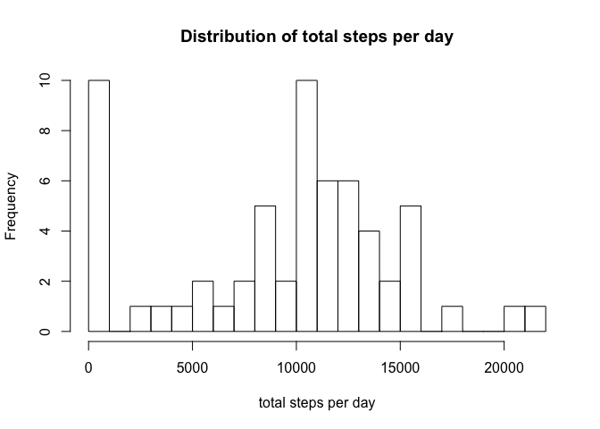
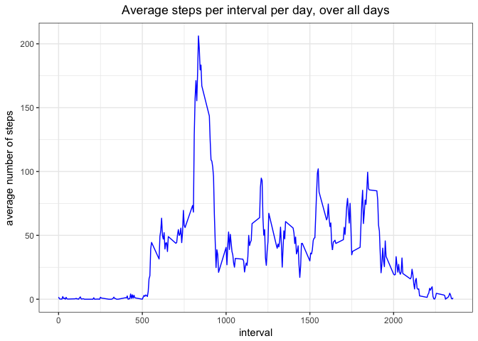
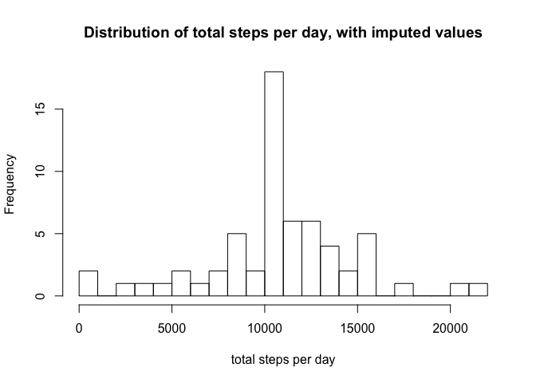
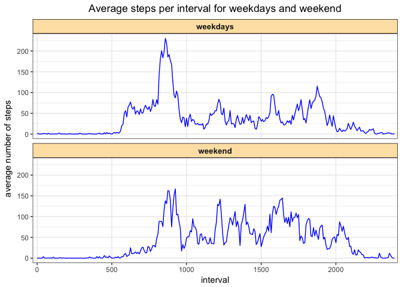

# Reproducible Research: Peer Assessment 1


## Loading and preprocessing the data

```r
data1<-read.csv("activity.csv")
```

Examine the data:

```r
str(data1)
```

```
## 'data.frame':	17568 obs. of  3 variables:
##  $ steps   : int  NA NA NA NA NA NA NA NA NA NA ...
##  $ date    : Factor w/ 61 levels "2012-10-01","2012-10-02",..: 1 1 1 1 1 1 1 1 1 1 ...
##  $ interval: int  0 5 10 15 20 25 30 35 40 45 ...
```

## What is mean total number of steps taken per day?
Load the dplyr and ggplot2 packages. 

```r
library(dplyr)
```

```
## 
## Attaching package: 'dplyr'
```

```
## The following objects are masked from 'package:stats':
## 
##     filter, lag
```

```
## The following objects are masked from 'package:base':
## 
##     intersect, setdiff, setequal, union
```

```r
library(ggplot2)
```

Calculate the total number of steps per day.  

```r
total_per_day <- data1 %>% group_by(date) %>% summarise(total_steps = sum(steps,na.rm=TRUE))
```

Create a histogram of the total number of steps per day.  

```r
hist(total_per_day$total_steps,breaks = 20,xlab="total steps per day",main="Distribution of total steps per day")
```

<!-- -->

Calculate the average total number of steps per day.  

```r
mean(total_per_day$total_steps, na.rm=TRUE)
```

```
## [1] 9354.23
```

Calculate the median total number of steps per day.  

```r
median(total_per_day$total_steps, na.rm=TRUE)
```

```
## [1] 10395
```


## What is the average daily activity pattern?
Calculate the average number of steps per interval, per day (across all days) and store the result in 'avg_across_days'.

```r
data1$interval<-as.factor(data1$interval)
avg_across_days <- data1 %>% group_by(interval) %>% summarise(avg_steps = mean(steps,na.rm=TRUE))
```

Plot the the average number of steps vs interval, across all days.

```r
x_ticks<-c(0,500,1000,1500,2000)
avg_across_days$interval<-as.numeric(as.character(avg_across_days$interval))

g<-ggplot(avg_across_days,aes(x=interval,y=avg_steps))
g2<-g + geom_line(color="blue",group=1) + theme_bw() + labs(title=paste("Average steps per interval per day, over all days")) + xlab("interval") + ylab("average number of steps") + theme(plot.title = element_text(hjust = 0.5))
g2 + scale_x_continuous(breaks=x_ticks) 
```

<!-- -->

Find and display the 5 minute interval (in minutes) with the maximum number of steps.

```r
ind<-which(avg_across_days$avg_steps==max(avg_across_days$avg_steps))
as.numeric(as.character(avg_across_days[ind,1]))
```

```
## [1] 835
```


## Imputing missing values
Get the number of rows that have Na in the step column.

```r
sum(is.na(data1$steps))
```

```
## [1] 2304
```

Fill in missing values with mean values for that interval.

```r
ind<-which(is.na(data1$steps))
data2 <- data1
for (i in 1:length(ind)) {
        int<-as.numeric(as.character(data2[ind[i],3]))
        ind2<-which(avg_across_days$interval==int)
        data2[ind[i],1]<-avg_across_days[ind2,2]
}
```

Examine the data.

```r
str(data2)
```

```
## 'data.frame':	17568 obs. of  3 variables:
##  $ steps   : num  1.717 0.3396 0.1321 0.1509 0.0755 ...
##  $ date    : Factor w/ 61 levels "2012-10-01","2012-10-02",..: 1 1 1 1 1 1 1 1 1 1 ...
##  $ interval: Factor w/ 288 levels "0","5","10","15",..: 1 2 3 4 5 6 7 8 9 10 ...
```

Calculate the total number of steps per day with the imputed values.  

```r
total_per_day <- data2 %>% group_by(date) %>% summarise(total_steps = sum(steps,na.rm=TRUE))
```

Create a histogram of the total number of steps per day.  

```r
hist(total_per_day$total_steps,breaks = 20,xlab="total steps per day",main="Distribution of total steps per day, with imputed values")
```

<!-- -->

Calculate the average total number of steps per day with the imputed values.    

```r
mean(total_per_day$total_steps, na.rm=TRUE)
```

```
## [1] 10766.19
```

Calculate the median total number of steps per day with the imputed values.  

```r
median(total_per_day$total_steps, na.rm=TRUE)
```

```
## [1] 10766.19
```


## Are there differences in activity patterns between weekdays and weekends?

Add a column (variable) to identify each day as either weekend or weekdays, using the data set with imputed values.

```r
data2$date<-strptime(data2$date,"%Y-%m-%d")
data2$weekday<-as.factor(weekdays(data2$date))
levels(data2$weekday)<-c("weekdays","weekdays","weekend","weekend","weekdays","weekdays","weekdays")
data2$date<-as.character(data2$date)
```

Examine the data.

```r
str(data2)
```

```
## 'data.frame':	17568 obs. of  4 variables:
##  $ steps   : num  1.717 0.3396 0.1321 0.1509 0.0755 ...
##  $ date    : chr  "2012-10-01" "2012-10-01" "2012-10-01" "2012-10-01" ...
##  $ interval: Factor w/ 288 levels "0","5","10","15",..: 1 2 3 4 5 6 7 8 9 10 ...
##  $ weekday : Factor w/ 2 levels "weekdays","weekend": 1 1 1 1 1 1 1 1 1 1 ...
```

Calculate the average number of steps per interval, for weekends and weekdays. Store the result in 'avg_across_wdays'.

```r
avg_across_wdays <- data2 %>% group_by(interval,weekday) %>% summarise(avg_steps = mean(steps,na.rm=TRUE))
```

Plot the activity pattern for weekends and weekdays.

```r
g<-ggplot(avg_across_wdays,aes(x=interval,y=avg_steps))
g2 <- g + geom_line(color="blue",group=1) + facet_wrap(~weekday,ncol=1) + scale_x_discrete(breaks=x_ticks) + theme_bw() +theme(strip.text.x = element_text(size=10, face="bold", angle=0),strip.background = element_rect(colour="black", fill="#fee3b3"))
g2 +labs(title=paste("Average steps per interval for weekdays and weekend")) + xlab("interval") + ylab("average number of steps") + theme(plot.title = element_text(hjust = 0.5))
```

<!-- -->
